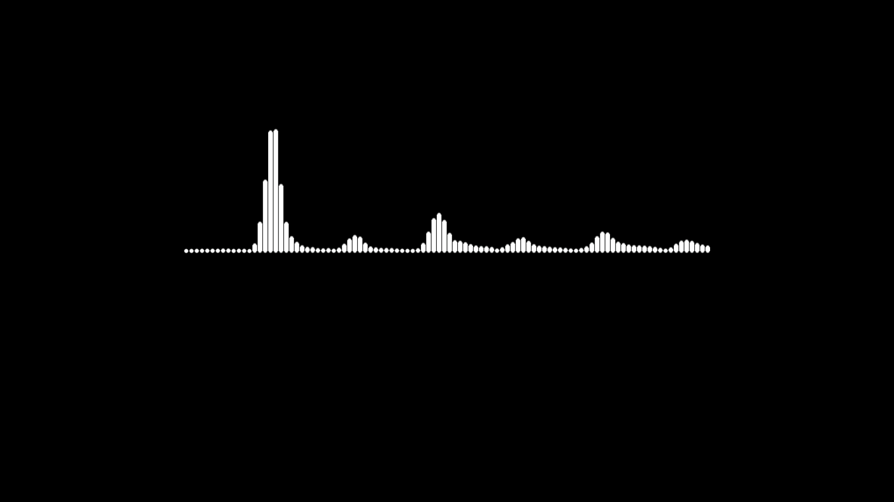
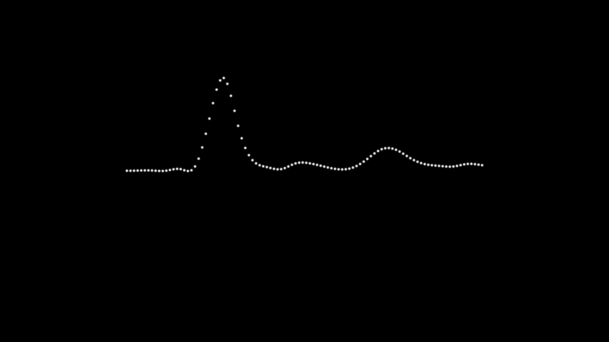
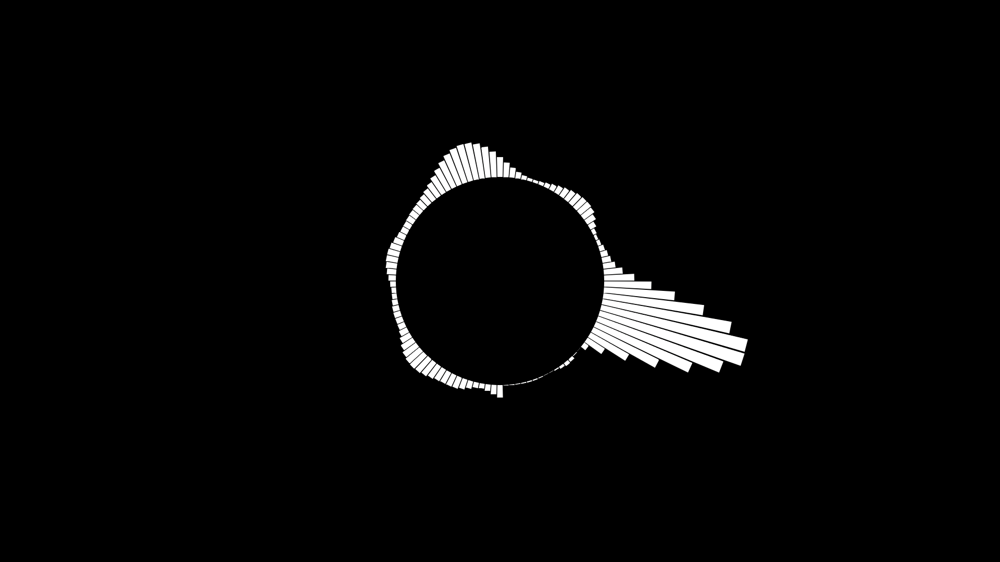
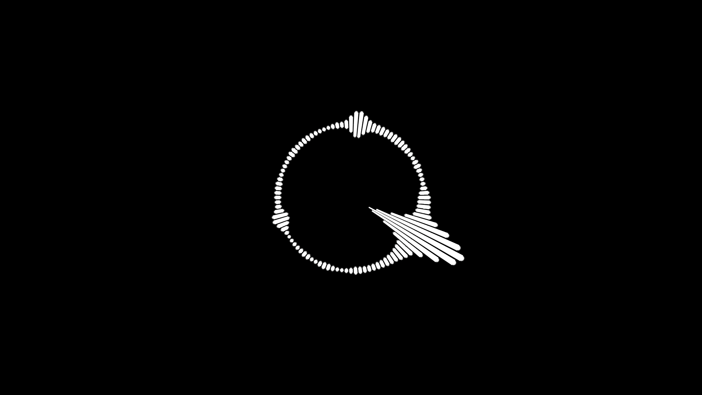

# Spline-Audio-Spectrum
A Script for AviUtl that Draw an Audio Spectrum Like After Effects. 
AviUtlで音声波形を描画するスクリプトです。 
FFTを使用しているので、[After Effects](https://www.adobe.com/jp/products/aftereffects.html)の音声波形とほぼ同じ形状、動きの波形ができます。 
設定項目も、AfterEffectsとほぼ同じです。 (一部実装出来ていないものもあります) 
また、補間に3次スプラインを使用しているため、非常に滑らかな波形を描画可能です。 

## 要件
[Rikky Module](https://hazumurhythm.com/wev/amazon/?script=NRMv2q9Q&keyword=rikky_module&search_price=&sort=viewh&filter=all&page=1)を導入している必要があります。

必須ではありませんが、軽量化のために *LuaJIT* の導入を推奨します (体感2倍ぐらい軽くなります)  
参考 → [LuaJITを導入して動作を高速化しよう！](https://aketama.work/aviutl-luajit)

## ファイル内容
  - **Screenshots** 
    このスクリプトで描画された音声波形の画像です。ご参考に

  - **Spline-AudioSpectrum.obj** 
	スクリプト本体です。

  - **README.md** 
	Markdown形式のREADMEです。

  - **LICENSE** 
	ライセンスについて書かれています。

## 導入方法
  - *AE_Audio-Spectrum.obj*をAviUtlのscriptフォルダにコピーしてください。

## 設定項目
  - **トラックバー** 
	- 開始位置 
	  波形の開始位置 (左端) の位置 (X) を指定します。

	- 終了位置 
	  波形の終了位置 (右端) の位置 (X) を指定します。

	- 周波数帯 
	  波形の線の量を指定します。

	- 高さ 
	  波形の高さを指定します。

  - **ダイアログ** 
	- 色 
	  波形の色を設定します。

	- 開始周波数 (0 ~ ) 
	  計算する周波数帯の開始周波数を設定します。

	- 終了周波数 (0 ~ ) 
	  終了周波数を設定します。

	- サンプルレベル (0, 1, 2, 3) 
	  スペクトラムを計算する際のサンプルレベルを設定します。 
	  低い値を設定すると、時間軸は細かくなりますが、分割数は荒くなります。 
	  高い値を設定すると、分割数は細かくなりますが、時間軸は荒くなります。 
    
 - AUDIOデゥレーション 
    複数フレームの波形を取得し、それらを平均化します。
    要するに、動きがより滑らかになります
    代わりに、負荷が高くなります。

	- AUDIOオフセット 
	  取得するスペクトラムのフレームオフセットを設定します。 
	  -1を設定すると、1フレーム前の波形を取得します。 
	  1を設定すると、1フレーム後の波形を取得します。 
	  同様に、-2だと2フレーム前、2だと2フレーム後を取得します。 

	- 太さ (0 ~ ) 
	  波形の太さを設定します。

	- ディスプレイオプション (0, 1, 2) 
	  描画する波形の種類を設定します。 
	  - 0 = 先端が丸い波形
	  - 1 = 先端が平らな波形
	  - 2 = 点のみの波形

	- サイドオプション (0, 1, 2) 
	  波形を描画する方向を設定します。
	  - 0 = 上下両方向
	  - 1 = 上方向のみ
	  - 2 = 下方向のみ

 - 丸くする  
   波形を極座標変換のように、丸くして描画します。
   外側に行くほど線が太くなり、内側に行くほど細く描画されます。
   
 - 半径  
    丸くした時の半径を設定します
    
## 既知のバグ

* 円形描画の際に、内側方向に中心を超えた線が描画されなくなります。

## ライセンス
GNU General Public License v2.0 
詳しくは同梱のLICENSEをご覧ください。

## スクリーンショット

